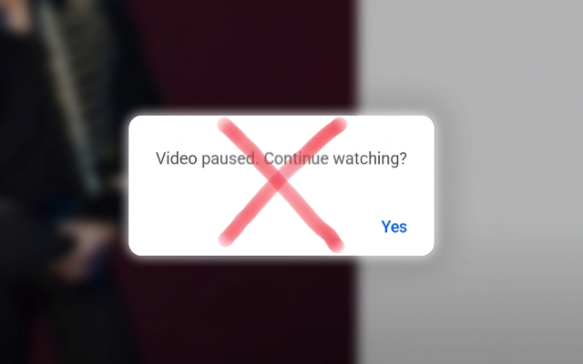

# YouTube™ YTMusic™ Nonstop

Prevent auto-pause, keep YouTube & YouTube Music nonstop

## Introduction
This extension prevents YouTube and YouTube Music from auto-pausing due to inactivity or background tab. It keeps your music and videos playing nonstop, even if you switch tabs or leave the browser running.

# Installation:

- Install the extension from Chrome Web Store: [YouTube™ YTMusic™ Nonstop](https://chromewebstore.google.com/detail/youtube-ytmusic-nonstop/bobdimbkbnkabpfhdfbddjoppiohcodi)

- Or install via user script from [Greasyfork](https://greasyfork.org/vi/scripts/546130-youtube-ytmusic-nonstop)

##  

